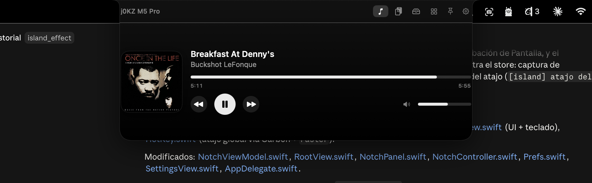

# Island Effect

Convierte el notch del MacBook en una isla interactiva, al estilo de
[NotchNook](https://lo.cafe/notchnook), pero nativa, propia y sin licencia.

App de macOS en Swift + SwiftUI, sin dependencias externas. Vive en la barra de
menús (`LSUIElement`), dibuja un panel flotante encima del notch y se expande al
pasar el mouse.



## Qué hace

**Isla que se expande**
- En reposo es indistinguible del notch. Al pasar el mouse se abre con un
  resorte tipo Dynamic Island; al salir se cierra sola.
- Clic en el notch = fijar abierta / cerrar. El botón de chincheta la mantiene
  abierta mientras hagas cosas dentro.
- Esquinas superiores invertidas para fundirse con el borde de la pantalla.
- En pantallas **sin notch** se convierte en un asa centrada bajo la barra de
  menús, con la misma funcionalidad.
- Multi‑monitor: sigue la pantalla donde está el mouse (configurable).

**Live activities** (con la isla cerrada, alrededor del notch)
- Cambio de canción: carátula + ecualizador animado.
- Volumen y brillo al tocar las teclas.
- Conexión/desconexión del cargador.
- Fin del temporizador.

**Música** — Apple Music y Spotify
- Carátula, título, artista, barra de progreso con scrubbing, anterior/play/
  siguiente y volumen del sistema.
- Clic en la carátula abre la app de origen.

**Portapapeles**
- Historial buscable de texto, imágenes y archivos, con la app de origen y hace
  cuánto se copió.
- Ítems fijables, atajo global configurable (por omisión `⌥⌘V`), pegado
  automático opcional y filtro de contenido confidencial (contraseñas).

**Repisa de archivos**
- Arrastra archivos al notch y quedan ahí. Arrástralos de vuelta a donde
  quieras, o usa abrir / mostrar en Finder / copiar ruta.
- Persiste entre sesiones.

**Widgets**
- Reloj y fecha, sliders de volumen y brillo, batería + RAM + disco, y
  temporizador con presets.

**Gestos sobre el notch**
- Scroll vertical = volumen.
- Scroll horizontal = canción anterior / siguiente.
- Arrastrar archivos = van a la repisa.

**Preferencias** (ícono de engranaje en la isla o el menú de la barra)
- Tamaño abierto, radio de esquinas, ancho extra en reposo, degradado.
- Retardos de apertura/cierre, háptica, pantalla a seguir, abrir al iniciar sesión.
- Qué pestañas y qué live activities quieres, y su duración.

## Instalar

```bash
./build.sh --install
```

Compila, arma `Island Effect.app`, la firma ad‑hoc, la copia a `/Applications` y
la lanza. Sin el flag solo compila en `build/`; con `--run` la ejecuta desde ahí.

Requiere macOS 14 o superior y las Command Line Tools de Xcode (`swift`).

## Permisos que pide macOS

| Permiso | Para qué | Cuándo |
|---|---|---|
| Automatización (Música / Spotify) | Leer y controlar la reproducción | La primera vez que hay un reproductor abierto |
| Accesibilidad | Pegar solo al elegir del historial | Opcional: sin él se copia y pegas con `⌘V` |

Ninguno es obligatorio: sin ellos la app funciona, solo pierdes esas piezas.

> Al estar firmada ad‑hoc, macOS le da una identidad nueva en cada recompilación
> y puede volver a pedir los permisos. Es normal en apps locales sin certificado
> de desarrollador.

## Cómo está hecho

| Archivo | Rol |
|---|---|
| `NotchPanel.swift` | `NSPanel` sin bordes sobre la barra de menús, con click‑through fuera de la isla |
| `NotchController.swift` | Posición, hover, gestos, live activities, multi‑monitor |
| `NotchViewModel.swift` | Estado (cerrada / abierta / activity), tamaños, temporizador |
| `NotchShape.swift` | La forma con esquinas superiores invertidas |
| `RootView.swift` | Isla cerrada (activities) y abierta (pestañas) |
| `MediaManager.swift` | Now playing y control vía AppleScript, con sondeo adaptativo |
| `ClipboardStore.swift` / `ClipboardView.swift` | Historial del portapapeles |
| `HotKey.swift` | Atajo global (Carbon) |
| `ShelfStore.swift` / `ShelfView.swift` | Repisa de archivos |
| `SystemMonitors.swift` | Volumen (CoreAudio), brillo (DisplayServices), batería (IOKit), RAM |
| `WidgetsView.swift` | Widgets |
| `SettingsView.swift` | Preferencias + ítem de inicio |

### Limitaciones conocidas

- El *now playing* solo cubre **Música y Spotify**. macOS 15.4 cerró el
  framework privado `MediaRemote` para apps sin entitlements de Apple, así que
  no hay forma pública de leer lo que suena en un navegador.
- El HUD nativo de volumen/brillo de macOS sigue apareciendo; la isla lo
  complementa, no lo reemplaza.

### Depuración

```bash
ISLAND_DEBUG=1 ISLAND_LOG=/tmp/island.log open -n build/Island\ Effect.app
```

`ISLAND_TAB=music|clipboard|shelf|widgets` fuerza la pestaña inicial.
